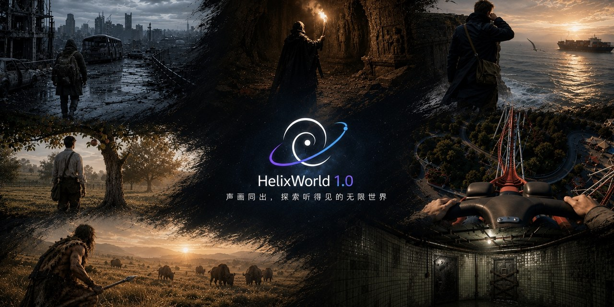

<p align="center">
  
</p>

# HelixWorld

**HelixWorld 1.0** is a real-time interactive audio-visual world model from [Noiz AI](https://noiz.ai), built with researchers from HKUST, Tsinghua, CMU, and Google DeepMind.

Give it an image and a prompt. The world keeps generating as you move. Walk forward, turn around — picture and sound update together. Audio is not a soundtrack laid on afterwards. A native Transformer generates video and audio from the same world state.

> **Status:** this repository is a public placeholder. Model weights, inference code, and the technical report will be released in the coming weeks. Open a [feature request](https://github.com/NoizAI/HelixWorld/issues/new?template=feature_request.yml) if you want something on the roadmap.

<p align="center">
  <a href="https://github.com/NoizAI/HelixWorld/issues/2"></a>
  <a href="https://github.com/NoizAI/HelixWorld/issues/4"></a>
  <a href="https://github.com/NoizAI/HelixWorld/issues/4"></a>
  <a href="https://github.com/NoizAI/HelixWorld/issues/3"></a>
  <a href="https://github.com/NoizAI/HelixWorld/issues/3"></a>
  <a href="LICENSE"></a>
</p>

## Why audio belongs in the world

Video generators have pushed resolution, physics, and shot language a long way. The result is still a clip: prompt in, video out, play from start to finish. You cannot turn a corner, and you cannot decide what happens next.

Interactive world models change that. Press forward and the world unfolds; turn around and the street behind you is generated on the spot. The missing piece has been sound. Open a door and there is no latch. Step through a puddle and there is no splash. The picture is live; the ears are still in a silent film.

In an interactive world, sound is not BGM. Distance, material, and direction all change it. Footsteps behind you, or a collision around a corner, often reach the ears first. HelixWorld generates picture and sound together, so each user action updates both.

## Highlights

| Capability | HelixWorld 1.0 |
| --- | --- |
| Roaming / camera navigation | Yes |
| Real-time interaction | 24 FPS |
| Continuous generation | > 3 minutes |
| Native joint audio-video | Yes — 48 kHz stereo, same Transformer |
| Spatial sound field | Yes — azimuth, distance, and reverb evolve with viewpoint |
| Open weights and code | Coming soon |

Against current interactive world models (Genie 3, WorldPlay, LingBot-World, and others), the usual stack is visual roaming only. HelixWorld's difference is native audio-video generation plus a spatial field that turns with the camera.

## Release status

| Item | Status |
| --- | --- |
| Public announcement | Done |
| Technical report / paper | [Coming soon](https://github.com/NoizAI/HelixWorld/issues/2) |
| Model weights + inference code | [Coming soon](https://github.com/NoizAI/HelixWorld/issues/1) |
| Training code | Coming soon — comment on [#1](https://github.com/NoizAI/HelixWorld/issues/1) if you need it in the first drop |
| Checkpoints on Hugging Face | [Coming soon](https://github.com/NoizAI/HelixWorld/issues/4) |
| Interactive demo | [Coming soon](https://github.com/NoizAI/HelixWorld/issues/3) |
| Evaluation suite (spatial audio + AV sync) | [Feature request](https://github.com/NoizAI/HelixWorld/issues/9) |
| Dataset release | Not planned for 1.0 — [request it](https://github.com/NoizAI/HelixWorld/issues/new?template=feature_request.yml) |

Watch this repository, or subscribe to [releases](https://github.com/NoizAI/HelixWorld/releases).

## Method overview

HelixWorld is trained in four stages. Details, figures, and ablations ship with the technical report.

```text
spatial AV data  →  joint Transformer + action
                 →  causal rollout (KV cache, self-generated history)
                 →  few-step distillation (trajectory + DMD) for realtime
```

1. **Find sound that actually has space.** Visual pose estimators can recover camera trajectories. Spatial audio does not come for free. HelixWorld trains on first-person real-world video (on-location sound) and game-engine captures (known geometry, materials, source positions, and listener pose). Cleaning drops fake stereo, post-hoc scores, and narration; remaining clips are checked for frame-level image-audio alignment.
2. **Make picture and sound field respond to action together.** Starting from an audio-video generation backbone, audio and video keep their own latents but enter one Transformer and exchange information. The model predicts the next picture and sound from the current state and the user's action. A turn should rotate the whole field, not just the pixels.
3. **Generate from the past only.** Bidirectional video models can look at future frames. Interaction cannot. The model is converted to a causal generator with KV cache and chunked autoregressive rollout, then trained on its own generated history so errors do not compound as fast at deploy time.
4. **Compress joint generation to realtime.** Trajectory distillation plus distribution-matching distillation (DMD) cut denoising from tens of steps to a handful. With KV cache and chunked generation, action, joint decode, and AV output run as a pipeline.

## Installation

Coming soon. The intended path:

```bash
git clone https://github.com/NoizAI/HelixWorld.git
cd HelixWorld
# uv sync   # or pip install -e .
```

Hardware, CUDA, and checkpoint download instructions will land with the inference code.

## Inference

Coming soon. Expected 1.0 interface (subject to change):

```python
# from helixworld import HelixWorld

# model = HelixWorld.from_pretrained("...")
# stream = model.interact(
#     image="examples/start.png",
#     prompt="A rainy alley at night, neon reflections on wet pavement",
#     fps=24,
# )
# for frame, audio in stream.step(action="forward"):
#     ...
```

## Project layout

```text
HelixWorld/
├── README.md
├── LICENSE
├── CONTRIBUTING.md
├── pyproject.toml          # package metadata; install extras coming soon
├── helixworld/             # inference / model package (coming soon)
├── configs/                # model and sampling configs (coming soon)
└── examples/               # prompts, images, and scripts (coming soon)
```

## Roadmap

HelixWorld 1.0 is the first step: real-time audio-video interaction. These are the next research problems. Each one is tracked as a feature request — comment there, or file a new one.

| Direction | What we mean | Tracker |
| --- | --- | --- |
| Multi-agent | Characters with identity, goals, and memory; stories that emerge from contact, not a fixed script | [#5](https://github.com/NoizAI/HelixWorld/issues/5) |
| Multi-person presence | Several people and agents in one space; who spoke, to whom, from where | [#6](https://github.com/NoizAI/HelixWorld/issues/6) |
| Long-horizon consistency | Hours or days: identity, spatial state, and cause-effect have to persist | [#7](https://github.com/NoizAI/HelixWorld/issues/7) |
| Autonomous evolution | The world keeps running with no new prompt and nobody in it | [#8](https://github.com/NoizAI/HelixWorld/issues/8) |
| Engine / product integrations | Games, interactive film, education | [#10](https://github.com/NoizAI/HelixWorld/issues/10) |

Downstream we care about: games, interactive film, education. If you have a concrete integration in mind, open a request and say so.

## Citation

Coming soon. Until the report is out, you can cite this repository:

```bibtex
@misc{helixworld2026,
  title        = {HelixWorld: A Real-Time Interactive Audio-Visual World Model},
  author       = {{Noiz AI}},
  year         = {2026},
  howpublished = {\url{https://github.com/NoizAI/HelixWorld}},
  note         = {Weights and code forthcoming}
}
```

## License

Code in this repository is released under the [Apache License 2.0](LICENSE).

The license for model weights will be published with the checkpoint release. Until then, weights are not available.

## Acknowledgments

HelixWorld is developed by Noiz AI with researchers from HKUST, Tsinghua, CMU, and Google DeepMind.

Related open work from the team: [AudioX](https://github.com/ZeyueT/AudioX), [AudioX-Turbo](https://github.com/NoizAI/AudioX-Turbo), [YuE](https://github.com/multimodal-art-projection/YuE).
